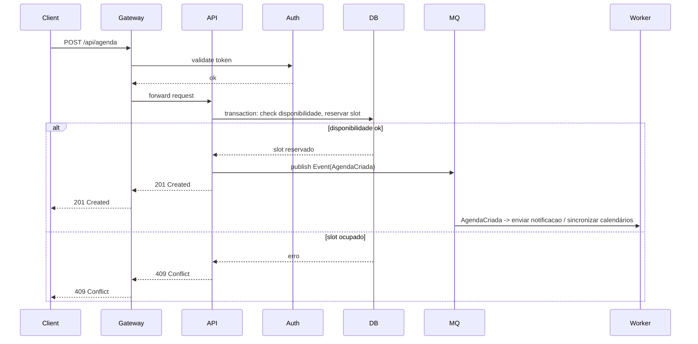

# Sistema de Gestão para Clínicas e Hospitais — Arquitetura Backend (Spring Boot)

> Documento para o repositório GitHub — contém visão arquitetural, decisões de stack, fluxogramas (Mermaid), entidades principais, endpoints e instruções iniciais para infraestrutura, segurança e CI/CD.

---

## Sumário

1. Visão geral
2. Decisões de tecnologia
3. Arquitetura (fluxograma / diagramas)
4. Modelagem de dados (ERD)
5. Principais entidades e relacionamentos
6. Endpoints REST principais
7. Agenda (calendar) — design e regras de negócio
8. Segurança
9. Padrões de projeto e organização do código
10. Infraestrutura e deploy
11. CI/CD, testes e observabilidade
12. Exemplo de `application.yml` e variáveis de ambiente
13. Passo-a-passo inicial para criar o projeto

---

## 1. Visão geral

Sistema backend para gestão de clínicas e hospitais com módulos principais:
- Gestão de unidades (clínicas/hospitais)
- Gestão de profissionais (médicos, enfermeiros)
- Gestão de pacientes
- Gestão de convênios
- Gestão de materiais e insumos
- Agenda (tipo Google Calendar) com permissões e regras de negócio
- Administração (RBAC) — administração das agendas, usuários e todo o sistema

Requisitos não-funcionais principais:
- Segurança e conformidade (LGPD)
- Escalabilidade horizontal
- Observabilidade e testes automatizados
- Arquitetura modular (bounded contexts) e preparada para microsserviços

---

## 2. Decisões de tecnologia

- Linguagem: **Java 21 (LTS)** ou **Kotlin (opcional)**
- Framework: **Spring Boot 3.x**
- Persistência: **PostgreSQL** (recomendado) — pode usar MySQL se necessário
- ORM: **Spring Data JPA (Hibernate)**
- Segurança: **Spring Security + OAuth2 / OpenID Connect** (Keycloak ou outro IdP)
- Migrations: **Flyway**
- DTO/Mapeamento: **MapStruct**
- Validação: **Jakarta Bean Validation (Hibernate Validator)**
- Modelagem de APIs: **OpenAPI / Swagger**
- Integrações e mensageria: **RabbitMQ** ou **Kafka** para tarefas assíncronas
- Jobs/Agendamento: **Spring Scheduler / Quartz** para tarefas críticas
- Container: **Docker** e orquestração em **Kubernetes** (opcional)
- Observabilidade: **Prometheus + Grafana**, **Jaeger** para tracing
- Logs: **ELK / EFK** (Elastic / Filebeat / Kibana) ou Loki

---

## 3. Arquitetura (fluxograma / diagramas)

> Abaixo há diagramas Mermaid que podem ser renderizados no GitHub (ou em editores que suportem Mermaid).

### 3.1 Component Diagram (visão geral)

```mermaid
flowchart LR
  subgraph clients[Clientes]
    browser[Web / Mobile]
    integr[Integrations / Third-party]
  end

  subgraph gateway[API Gateway (opcional)]
    gw[API Gateway / Load Balancer]
  end

  subgraph auth[Identity]
    idp[Keycloak / OIDC]
  end

  subgraph backend[Backend Services]
    api[Spring Boot - Monolith / Modular]
    authSvc[Auth Service]
    agendaSvc[Agenda Module]
    coreSvc[Core: Clinicas/Médicos/Convênios]
    materials[Materials Service]
    worker[Worker / Jobs]
  end

  subgraph infra[Infraestrutura]
    db[(PostgreSQL)]
    cache[(Redis)]
    mq[(RabbitMQ / Kafka)]
    storage[(S3 / MinIO)]
    observ[Prometheus/Grafana/ELK]
  end

  browser -->|HTTPS| gw --> api
  integr -->|HTTPS| gw --> api
  api --> idp
  api --> db
  api --> cache
  api --> mq
  worker --> mq
  worker --> db
  api --> storage
  api --> observ
  db --> observ
```

### 3.2 Fluxograma de requisição (ex.: criação de agendamento)



---

## 4. Modelagem de dados (ERD)

```mermaid
erDiagram
  CLINICA ||--o{ UNIDADE : possui
  UNIDADE ||--o{ PROFISSIONAL : possui
  PROFISSIONAL ||--o{ AGENDA : possui
  PACIENTE ||--o{ AGENDAMENTO : realiza
  AGENDA ||--o{ AGENDAMENTO : contem
  CONVENIO ||--o{ PACIENTE : atende
  MATERIAL }|..|{ UNIDADE : "estoque em"
  AGENDAMENTO }|..|{ SERVICO : "para"

  CLINICA {
    int id PK
    string nome
    string cnpj
  }
  UNIDADE {
    int id PK
    int clinica_id FK
    string nome
    string endereco
  }
  PROFISSIONAL {
    int id PK
    int unidade_id FK
    string nome
    string crm
    string especialidade
  }
  PACIENTE {
    int id PK
    string nome
    date data_nascimento
    string cpf
    int convenio_id FK
  }
  AGENDA {
    int id PK
    int profissional_id FK
    string tipo (consulta/procedimento)
  }
  AGENDAMENTO {
    int id PK
    int agenda_id FK
    int paciente_id FK
    timestamp inicio
    timestamp fim
    string status
  }
```

---

## 5. Principais entidades e relacionamentos

- **Clinica / Unidade**: identificação, CNPJ, endereço, configurações regionais (fuso horário).
- **Profissional**: CRM, especialidades, disponibilidade padrão e exceções.
- **Agenda**: vinculada ao profissional; pode ter regras (duração padrão, slots, buffers, types).
- **Agendamento**: instância de slot reservado (status: CONFIRMADO, PENDENTE, CANCELADO, AUSENTE)
- **Paciente**: dados pessoais, convênios, histórico de agendamentos.
- **Convênio**: regras de cobertura, códigos de faturamento.
- **Material / Insumo**: estoque por unidade, lote, validade.

---

## 6. Endpoints REST principais (exemplos)

### Autenticação
- `POST /api/auth/login` (se usar JWT) — idealmente delegar ao IdP
- `POST /api/auth/refresh`

### Clínicas / Unidades
- `GET /api/clinicas`
- `POST /api/clinicas`
- `GET /api/clinicas/{id}`

### Profissionais
- `GET /api/profissionais`
- `POST /api/profissionais`
- `GET /api/profissionais/{id}`

### Pacientes
- `POST /api/pacientes`
- `GET /api/pacientes/{id}`

### Agenda & Agendamento
- `GET /api/profissionais/{id}/agenda` — retorna regras e slots
- `POST /api/agendamentos` — criar agendamento
- `PUT /api/agendamentos/{id}` — atualizar (status, remarcar)
- `GET /api/agendamentos?profissionalId=&data=` — buscar por filtros

### Materiais
- `GET /api/unidades/{id}/materiais`
- `POST /api/unidades/{id}/materiais`

---

## 7. Agenda (calendar) — design e regras de negócio

Regras propostas:
- Cada `Profissional` tem uma `Agenda` com regras base: dias trabalhados, horário de início/fim, duração padrão do slot, intervalo entre consultas e dias de folga.
- Suporte a **exceções**: bloqueios (férias, consultas bloqueadas), horários adicionais (plantões), reservas administrativas.
- Reserva de **buffer** antes/depois (ex.: 10 minutos) para limpeza/pré-consulta.
- Regras de **conflito**: transação DB com lock otimista/pessimista para evitar double-booking.
- Política de cancelamento e janelas de atualização (ex.: só remarca 24h antes).
- Notificações via fila (email/SMS/push) em eventos (criado, confirmado, cancelado).

Técnicas de implementação:
- Modelar `slot` de forma dinâmica: gerar slots sob demanda para uma faixa de data quando o usuário pedir — *não* armazenar slots indefinidamente.
- Ao criar agendamento: utilizar `SELECT ... FOR UPDATE` ou equivalente com transação para garantir atomicidade.
- Para alta concorrência: usar Redis Locks (Redisson) em blocos críticos.

---

## 8. Segurança

- Autenticação: **OAuth2 / OIDC** via provedor (Keycloak ou Auth0). Evitar custom JWT rolls.
- Autorização: **RBAC** com roles: ADMIN, MANAGER, RECEPCAO, PROFESSIONAL, PATIENT
- Criptografia: TLS para todo tráfego, criptografia de dados sensíveis em descanso (e.g., usar pgcrypto ou coluna criptografada)
- Logs: não logar dados sensíveis (CPF, cartão, dados pessoais)
- Auditoria: manter tabela de `audit_log` com operações CRUD críticas (quem, quando, o que)
- Proteções: validação rigorosa, rate limiting (API Gateway), WAF se aplicável
- LGPD: endpoints para exportação/exclusão de dados de paciente, consentimento e histórico de consentimento

---

## 9. Padrões de projeto e organização do código

Recomendo arquitetura limpa / hexagonal + DDD para bounded contexts:

- `com.company.project` (root)
  - `core` (entidades, repositorios, domain services)
  - `application` (usecases, DTOs, services)
  - `infrastructure` (JPA, adapters, queue, external clients)
  - `web` (controllers, exception handlers)
  - `config` (security, swagger, datasource)

Use módulos Maven/Gradle se for separar em subprojetos (e.g., `core`, `agenda-service`, `auth-service`).

---

## 10. Infraestrutura e deploy

- Dockerize o app (`openjdk:21-jdk-slim`) e use imagens leves.
- Orquestração: Kubernetes (namespaces: staging/prod)
- Banco: StatefulSet / managed Postgres
- Cache: Redis (session, locks)
- Messaging: RabbitMQ / Kafka
- Storage: S3 para arquivos (laudos, anexos)
- Backups: política de backup diário e retenção mínima 30 dias para dados críticos

---

## 11. CI/CD, testes e observabilidade

- CI: Github Actions (build, run tests, build image)
- CD: ArgoCD / Github Actions + helm charts
- Testes: Unit (JUnit 5), Integration (Testcontainers), Contract tests (Pact)
- Observability: Prometheus + Grafana, traces (Jaeger), structured logs (JSON)

---

## 12. Exemplo de `application.yml` (trecho)

```yaml
spring:
  datasource:
    url: ${JDBC_DATABASE_URL}
    username: ${JDBC_DATABASE_USERNAME}
    password: ${JDBC_DATABASE_PASSWORD}
  jpa:
    hibernate:
      ddl-auto: validate
    properties:
      hibernate:
        format_sql: true
flyway:
  enabled: true
  locations: classpath:db/migration

security:
  oauth2:
    resource:
      jwt:
        issuer-uri: ${OIDC_ISSUER}

management:
  endpoints:
    web:
      exposure:
        include: health,info,prometheus

logging:
  level:
    root: INFO
    com.company: DEBUG
```

> Variáveis de ambiente como `JDBC_DATABASE_URL`, `OIDC_ISSUER` devem ser gerenciadas via Secrets no Kubernetes.

---

## 13. Passo-a-passo inicial para criar o projeto

1. Criar projeto Spring Boot (Spring Initializr) com dependências: Web, Spring Data JPA, Validation, Spring Security (OAuth2 Resource Server), Flyway, Actuator
2. Configurar PostgreSQL local e Flyway scripts iniciais
3. Modelar entidades básicas (Clinica, Unidade, Profissional, Paciente, Agenda, Agendamento)
4. Implementar controller + service + repository para CRUD básico
5. Integrar Keycloak (ou outro IdP) e proteger endpoints
6. Implementar testes unitários e de integração (Testcontainers)
7. Dockerizar e criar Helm chart mínimo

---

## Apêndice — Exemplo de ERD simplificado (texto)

- `clinica` (id, nome, cnpj, created_at)
- `unidade` (id, clinica_id, nome, endereco)
- `profissional` (id, unidade_id, nome, crm, especialidade)
- `agenda` (id, profissional_id, tipo, duracao_minutos)
- `agendamento` (id, agenda_id, paciente_id, inicio, fim, status)
- `paciente` (id, nome, cpf, data_nascimento, convenio_id)
- `convenio` (id, nome, codigo)

---

### Contato

Se quiser, eu gero a estrutura inicial do projeto (ex.: `spring initializr` + skeleton de pastas, DTOs e controllers) e um `docker-compose` para rodar rápido em desenvolvimento. Diga se quer **Java** ou **Kotlin** e eu já crio o skeleton.

---

*Fim do documento.*

